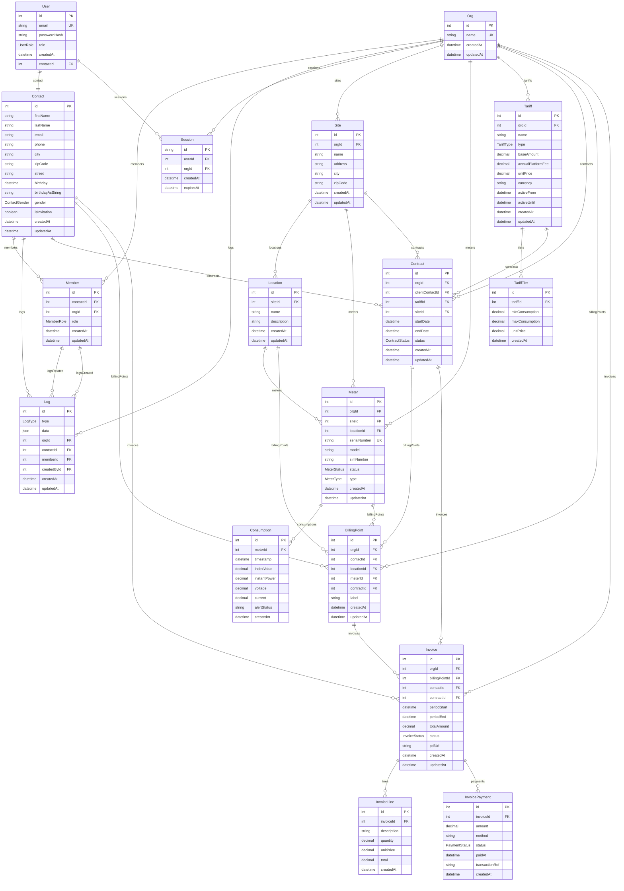

# Schéma de base de données — Compteur Connecté

## Diagramme entité-relation

## Légende des relations

| Notation | Signification |
|----------|---------------|
| `\|\|--\|\|` | Un et un seul (1:1) |
| `\|\|--o\{` | Un ou plusieurs (1:N) |
| `\}\|--o\|` | Zéro ou un (0..1:1) |
| `\}\|--o\{` | Zéro ou plusieurs (0..N) |

## Domaines

- **Auth** : `User`, `Session`
- **Organisation** : `Org`, `Member`, `Contact`
- **Audit** : `Log`
- **Parc** : `Site`, `Location`, `Meter`, `Consumption`
- **Facturation** : `Tariff`, `TariffTier`, `Contract`, `BillingPoint`, `Invoice`, `InvoiceLine`, `InvoicePayment`
